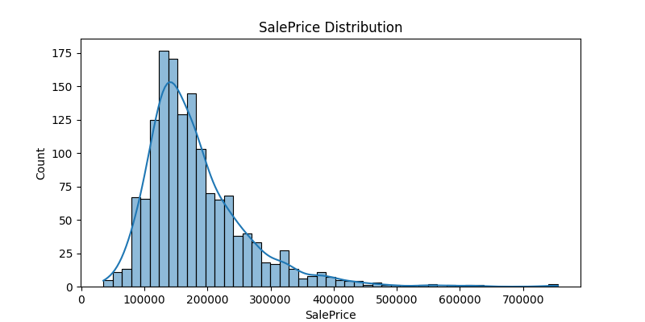
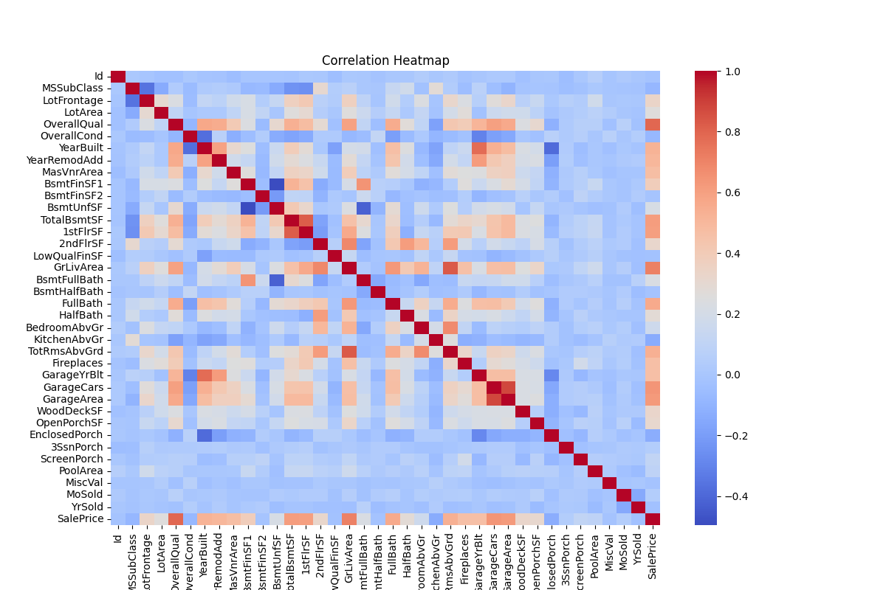
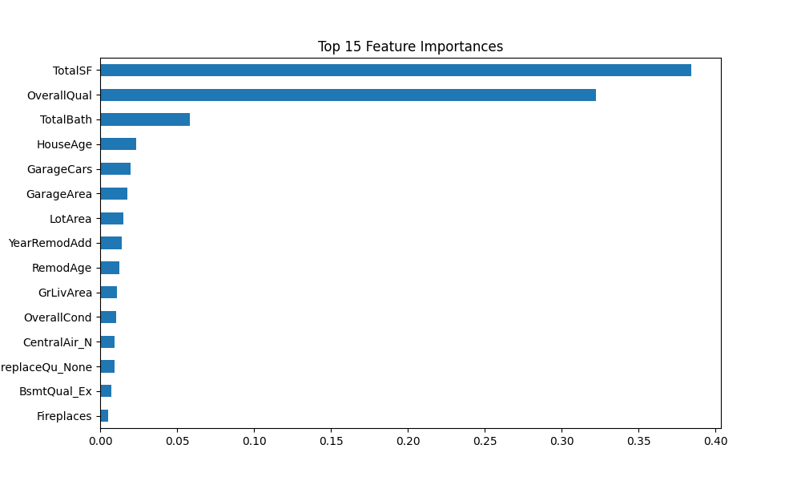

# 🏛️ House Price Prediction

A Machine Learning project that predicts house sale prices from property features. Started as a 3-day beginner mini-project, expanded into a full pipeline with multiple models, tuning, feature engineering, and a deployed Streamlit app.

---

## Overview

*   **Type:** Regression (predicts a continuous number)
*   **Dataset:** Kaggle "House Prices: Advanced Regression Techniques"
*   **Goal:** Predict `SalePrice` using property features like size, quality, and age
*   **Rows:** 1,460 training records

---

## Tech Stack

Python · pandas, numpy · matplotlib, seaborn · scikit-learn · joblib · Streamlit

---

## Project Structure

```
House-Price-Prediction/
├── data/          → train.csv, test.csv
├── notebooks/     → full analysis notebook
├── src/           → preprocess.py
├── models/        → saved model + columns
├── images/        → EDA and evaluation charts
├── app/           → Streamlit app
├── requirements.txt
└── README.md
```

---

## What I Did

*   **Cleaned the data with context** – most "missing" values weren't actually missing (e.g. `NA` in `PoolQC` means no pool), so filled feature-absence columns accordingly instead of blanket median/mode
*   **Engineered new features** – `TotalSF`, `HouseAge`, `RemodAge`, `TotalBath`. `TotalSF` became the single strongest predictor, ahead of most original columns
*   **Compared 5 models** – Linear Regression, Ridge, Lasso, Random Forest, and Gradient Boosting
*   **Tuned the best model** – GridSearchCV + 5-fold cross-validation on Gradient Boosting
*   **Checked feature importance** – `TotalSF` and `OverallQual` dominate
*   **Deployed as a Streamlit app** – custom dark/gold UI, results shown in NPR

---

## Results

| Model | MAE | RMSE | R² |
| --- | --- | --- | --- |
| **Gradient Boosting (tuned)** | 13,910 | 19,407 | **0.932** |
| Lasso | 14,021 | 19,508 | 0.931 |
| Ridge | 14,515 | 20,048 | 0.927 |
| Linear Regression | 15,357 | 21,762 | 0.914 |
| Random Forest | 16,339 | 23,452 | 0.900 |

_(Original 3-day version: plain Linear Regression, R² 0.65 — feature engineering + tuning closed most of the gap.)_

---

## Visualizations

  
  


---

## How to Run

```
git clone https://github.com/omsagarmandal/House-Price-Prediction.git
cd House-Price-Prediction
pip install -r requirements.txt
cd app
streamlit run app.py
```

---

## Note

This is a learning project, not a real valuation tool. See my [Diabetes Prediction System](https://github.com/omsagarmandal/Disease-Prediction-System) for the classification follow-up.

---

**Om Sagar Mandal**  
AI/ML Intern